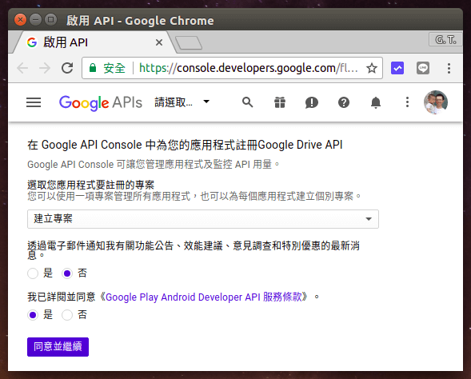
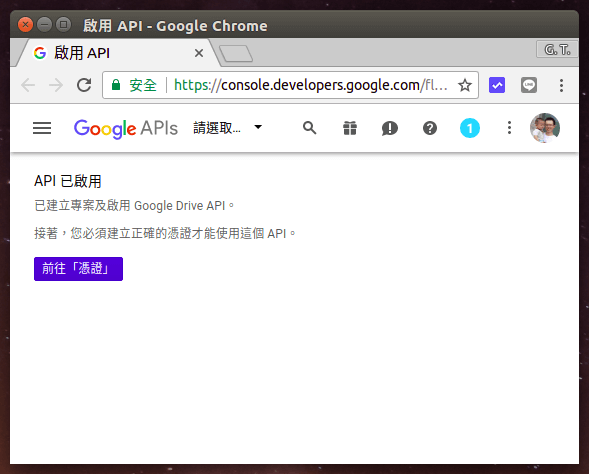
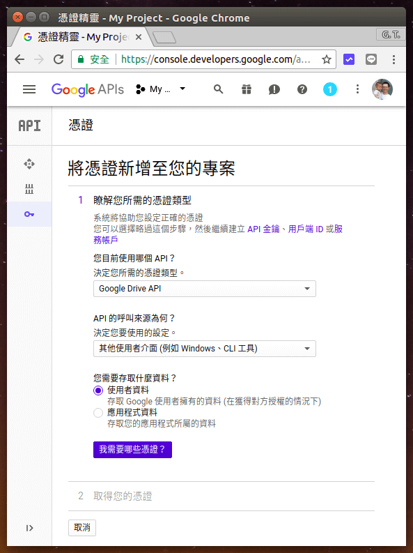
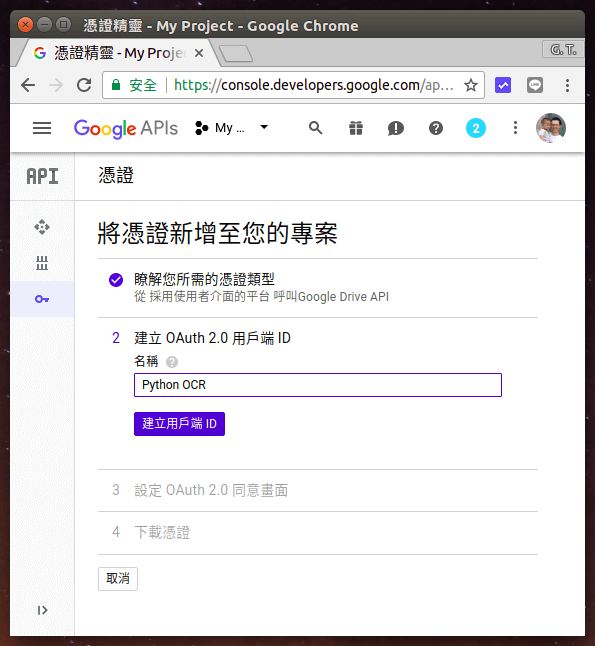
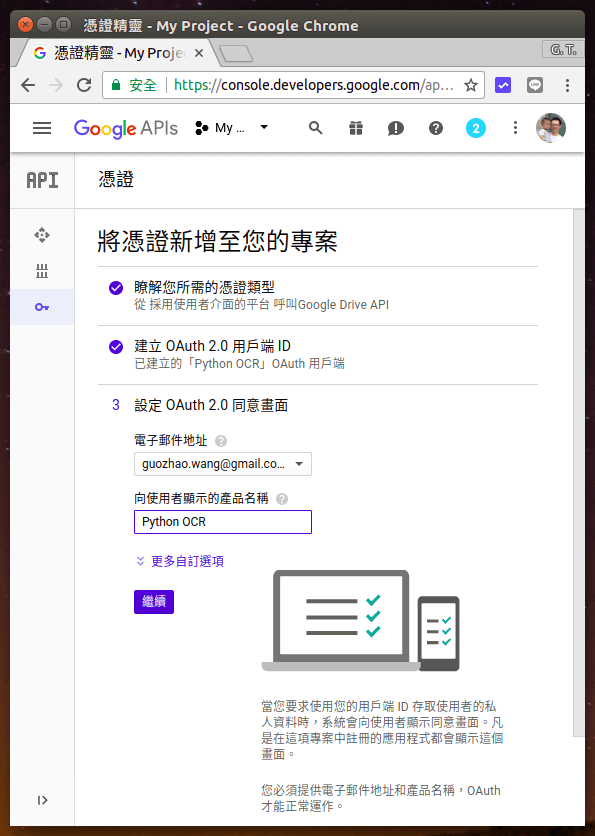
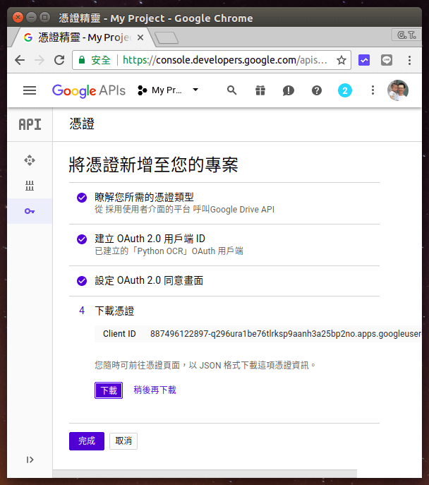

# Python 使用 Google 雲端硬碟 API 自動進行文字辨識

### 參考 [Google Developers](https://developers.google.com/drive/api/v3/quickstart/python) 的官方文件，啟用 Google 雲端硬碟 API。

## 啟用Google 雲端硬碟 API與取得憑證

1. 開啟 [Google Drive API](https://console.developers.google.com/flows/enableapi?apiid=drive) 註冊網頁，選擇「建立專案」，點選同意服務條款，然後點選「同意並繼續」。  
       
2. 啟用 API 之後，點選「前往憑證」。      
      
3. 憑證類型選擇「Google Drive API」，API 的呼叫來源選擇「其他使用者介面」，存取資料則選擇「使用者資料」。  
      
4. 填入名稱Python OCR。  
      
5. 設定同意畫面的 Email 與名稱，名稱Python OCR。  
      
6. 下載 JSON 格式的憑證檔案，下載後儲存為 client_id.json，這個檔案在之後的 Python 程式執行時會需要用到。下載完憑證之後，點選「完成」。  
      
    

## 安裝 Google Client Library

1. Google 所提供的 [API Client Libraries](https://developers.google.com/api-client-library/) 可以協助開發者加速程式的開發，請用 pip 安裝：
   
            pip install --upgrade google-api-python-client
